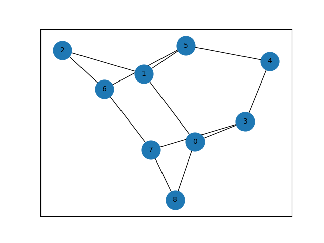

# grphpkg
**grphpkg** is a simple graph library that has DFS and BFS implemented that you can create your own operation.

## Graph
```python
from grphpkg import Graph
matrix_representation = [
    [0, 1, 0, 1, 0, 0, 0, 0, 1],
    [1, 0, 1, 0, 0, 1, 0, 0, 0],
    [0, 1, 0, 0, 0, 0, 1, 0, 0],
    [1, 0, 0, 0, 1, 0, 0, 1, 0],
    [0, 0, 0, 1, 0, 1, 0, 0, 0],
    [0, 1, 0, 0, 1, 0, 1, 0, 0],
    [0, 0, 1, 0, 0, 1, 0, 1, 0],
    [0, 0, 0, 1, 0, 0, 1, 0, 1],
    [1, 0, 0, 0, 0, 0, 0, 1, 0]
]

g = Graph(matrix_representation)                    # Initialize weighted graph with a matrix
g.print_graph()                                     # Print the graph
g.dfs(0, lambda x: print(str(x)+" ", end=""))       # Run DFS or BFS with custom callback
g.draw_graph()                                      # Graph visualization
```
> Create your callback function and pass it in dfs or bfs to execute your operation
## Weighted Graph
from grphpkg import Graph
```python
matrix = [
    [0, 2, 3, float('inf')],
    [2, 0, 1, 4],
    [3, 1, 0, 5],
    [float('inf'), 4, 5, 0]
]

weighted_graph = WeightedGraph(matrix)              # Initialize weighted graph with a matrix
weighted_graph.print_graph()                        # Print the graph
mst_edges, mst_cost = weighted_graph.prim_mst(0)    # Get minimun spanning and the edges
weighted_graph.draw_graph()                         # Graph visualization

```
## Graph visualization
Call draw graph function
```
g.draw_graph()
```



## Installing
```
pip install grphpkg
```

## Documentation

